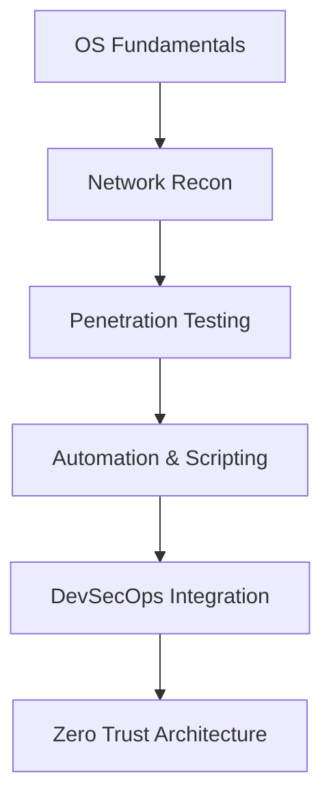

<!-- PERFIL README - CLEVESON GOMES - VERSÃO MR. ROBOT -->

<h1 align="center">
  
</h1>

<p align="center">
  
</p>

```diff
- if (system == vulnerable) {
+    exploit();
- } else {
+    secure();
- }
```

---

### 👨‍💻 Sobre Mim
```yaml
name: Cleverson Gomes
role: Cybersecurity & QA Analyst
affiliation: Estácio EAD - Defesa Cibernética
specialties:
  - Automated Testing
  - Ethical Hacking
  - Linux Security
contact: linkedin.com/in/cleverson-henrique-319423214
```

---

### 🚀 Skills & Tools
<div align="center">
  
</div>

---

### 🖥️ Mr. Robot Style Terminal
<div align="center">
  
</div>

---

### 💼 Projetos & Demos
| Projeto       | Descrição                                 | Link                                                 |
|---------------|-------------------------------------------|------------------------------------------------------|
| fsociety-lab  | HomeLab inspirado no Mr. Robot            | https://github.com/cleverson-gomes/fsociety-lab       |
| qa-framework  | Test Automation com arte de ASCII         | https://github.com/cleverson-gomes/qa-framework       |
| ssl-monitor   | Monitor de certificados com alertas glitched | https://github.com/cleverson-gomes/ssl-monitor        |

---

### 📈 GitHub Stats
<div align="center">
  
  
</div>

---

### 🌐 Connect with me
<p align="center">
  <a href="https://www.linkedin.com/in/cleverson-henrique-319423214/"></a>
  <a href="mailto:cleverson@email.com"></a>
</p>

---

### 🎯 Roadmap (fsociety Edition)


---

### 💡 Favorite Quote
> "Control is an illusion, but security is real." – Anonymous

<p align="center">
  
</p>

---

<p align="center">
  
</p>
