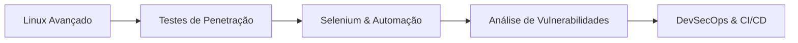

<!-- PERFIL README - CLEVESON GOMES - VERSÃO AVANÇADA -->

<h1 align="center">
  Bem-vindo ao meu **Universo Digital**! 🚀
  <br/>
  
</h1>

<p align="center">
  
</p>

---

### 👨‍💻 Sobre Mim
```yaml
Nome: Cleverson Gomes
Curso: Defesa Cibernética (EAD) - Estácio
Especialidade: QA & Testes Automatizados
Paixões: Hacking Ético, Scripts, Linux, Análise de Vulnerabilidades
Contato: cleverson@email.com | linkedin.com/in/cleverson-henrique-319423214
``` 

---

### 🚀 Skills & Ferramentas
<div align="center">
  
</div>

---

### 💼 Projetos em Destaque
| Projeto | Descrição | Link |
|---|---|---|
| **Pentest HomeLab** | Ambiente vulnerável para testes | https://github.com/cleverson-gomes/homelab-pentest |
| **QA Automation** | Framework de testes em Python e Selenium | https://github.com/cleverson-gomes/qa-automation |
| **Monitor de SSL** | Script para checar validade de certificados | https://github.com/cleverson-gomes/ssl-monitor |

---

### 📜 Certificações & Cursos
- 🎓 Certificado Ocupacional em Segurança da Informação (Estácio)
- 🏅 CompTIA Security+ (em andamento)
- 🛡️ Curso de Pentest Avançado (Udemy)

---

### 📈 Estatísticas do GitHub
<div align="center">
  
  
  
</div>

---

### 🌐 Conecte-se Comigo
<p align="center">
  <a href="https://www.linkedin.com/in/cleverson-henrique-319423214/" target="_blank"></a>
  <a href="https://twitter.com/cleverson" target="_blank"></a>
  <a href="https://medium.com/@cleverson" target="_blank"></a>
  <a href="mailto:cleverson@email.com"></a>
</p>

---

### 🎯 Roadmap de Aprendizado


---

### 💡 Citação Favorita
> "A melhor maneira de se defender é pensar como um atacante." – Adaptado de Kevin Mitnick

<p align="center">
  
</p>

---

<p align="center">
  
</p>
