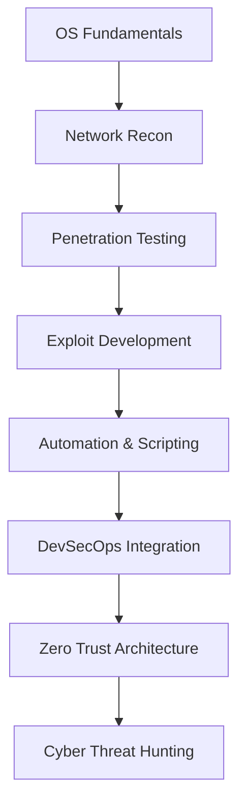

<!-- PERFIL README - CLEVESON GOMES - VERSÃO MR. ROBOT ULTRA -->

<h1 align="center">
  
</h1>

<p align="center">
  
  
</p>

```diff
- if (system == vulnerable) {
+    exploit();
- } else {
+    secure();
- }
```

---

### 👨‍💻 Sobre Mim
```yaml
name: Cleverson Gomes
role: Cybersecurity & QA Analyst
affiliation: Estácio EAD - Defesa Cibernética
specialties:
  - Automated Testing
  - Ethical Hacking
  - Linux Security
  - Python Development
  - Reverse Engineering
passion: Mr. Robot vibes, code rain, cyber mysteries
contact: linkedin.com/in/cleverson-henrique-319423214
```

---

### 🚀 Skills & Tools
<div align="center">
  
</div>

---

### 🖥️ Mr. Robot Style Terminal
<div align="center">
  
</div>

---

### 💼 Projetos & Demos
| Projeto             | Descrição                                                   | Link                                                 |
|---------------------|-------------------------------------------------------------|------------------------------------------------------|
| fsociety-lab        | HomeLab inspirado no Mr. Robot                              | https://github.com/cleverson-gomes/fsociety-lab      |
| qa-framework        | Framework de testes automatizados com arte ASCII            | https://github.com/cleverson-gomes/qa-framework      |
| ssl-monitor         | Monitoramento de SSL/TLS com alertas estilo glitch          | https://github.com/cleverson-gomes/ssl-monitor       |
| hack-sim            | Simulador visual de terminal hacker estilo Mr. Robot        | https://github.com/cleverson-gomes/hack-sim          |
| security_scanner.py | Scanner Python para segurança HTTP, SSL e fingerprint tech  | https://github.com/cleverson-gomes/security_scanner  |

---

### 📈 GitHub Stats
<div align="center">
  
  
  
</div>

---

### 🌐 Connect with me
<p align="center">
  <a href="https://www.linkedin.com/in/cleverson-henrique-319423214/"></a>
  <a href="mailto:cleverson@email.com"></a>
  <a href="https://twitter.com/cleverson"></a>
  <a href="https://github.com/cleverson-gomes"></a>
</p>

---

### 🎯 Roadmap (fsociety Edition)


---

### 💡 Favorite Quote
> "Control is an illusion, but security is real." – Elliot Alderson (Mr. Robot)

<p align="center">
  
</p>

---

### 🛡️ Security Scanner Highlights
<p align="center">
  
</p>

<p align="center">
  <a href="https://github.com/cleverson-gomes/security_scanner"></a>
  <a href="https://github.com/cleverson-gomes/security_scanner"></a>
  <a href="https://github.com/cleverson-gomes/security_scanner"></a>
  <a href="https://github.com/cleverson-gomes/security_scanner"></a>
</p>

<p align="center">
  
</p>
